# 🏛️ FoodRescue — Architecture & Flowcharts

This document details the system architecture, component topology, sequence flowcharts, verification pipelines, and entity relationships of the **FoodRescue** platform.

---

## 1. High-Level System Topology & Tier Architecture

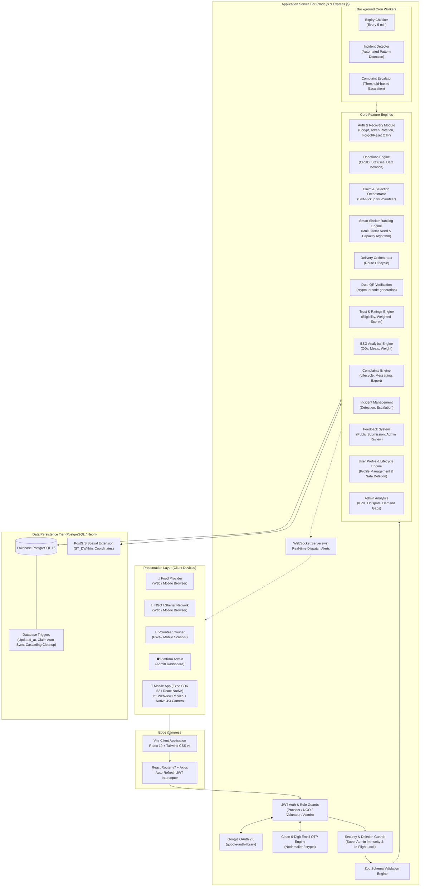
```mermaid
flowchart TB
    subgraph Clients["Presentation Layer (Client Devices)"]
        FP["🥖 Food Provider\n(Web / Mobile Browser)"]
        NGO["🤝 NGO / Shelter Network\n(Web / Mobile Browser)"]
        VOL["🚚 Volunteer Courier\n(PWA / Mobile Scanner)"]
        ADM["🛡️ Platform Admin\n(Admin Dashboard)"]
        MOB["📱 Mobile App (Expo SDK 52 / React Native)\n1:1 Webview Replica + Native 4:3 Camera"]
    end

    subgraph CDN["Edge & Ingress"]
        VITE["Vite Client Application\nReact 19 + Tailwind CSS v4"]
        ROUTER["React Router v7 + Axios\nAuto-Refresh JWT Interceptor"]
    end

    subgraph Backend["Application Server Tier (Node.js & Express.js)"]
        AUTH_MW["JWT Auth & Role Guards\n(Provider / NGO / Volunteer / Admin)"]
        GOOGLE["Google OAuth 2.0\n(google-auth-library)"]
        OTP_ENGINE["Clean 6-Digit Email OTP Engine\n(Nodemailer / crypto)"]
        SEC_GUARD["Security & Deletion Guards\n(Super Admin Immunity & In-Flight Lock)"]
        ZOD["Zod Schema Validation Engine"]
        
        subgraph Modules["Core Feature Engines"]
            MOD_AUTH["Auth & Recovery Module\n(Bcrypt, Token Rotation, Forgot/Reset OTP)"]
            MOD_DON["Donations Engine\n(CRUD, Statuses, Data Isolation)"]
            MOD_CLAIM["Claim & Selection Orchestrator\n(Self-Pickup vs Volunteer)"]
            MOD_RANK["Smart Shelter Ranking Engine\n(Multi-factor Need & Capacity Algorithm)"]
            MOD_DELIV["Delivery Orchestrator\n(Route Lifecycle)"]
            MOD_QR["Dual-QR Verification\n(crypto, qrcode generation)"]
            MOD_REV["Trust & Ratings Engine\n(Eligibility, Weighted Scores)"]
            MOD_ESG["ESG Analytics Engine\n(CO₂, Meals, Weight)"]
            MOD_COMP["Complaints Engine\n(Lifecycle, Messaging, Export)"]
            MOD_INC["Incident Management\n(Detection, Escalation)"]
            MOD_FB["Feedback System\n(Public Submission, Admin Review)"]
            MOD_USER["User Profile & Lifecycle Engine\n(Profile Management & Safe Deletion)"]
            MOD_ADM_AN["Admin Analytics\n(KPIs, Hotspots, Demand Gaps)"]
        end

        WS["WebSocket Server (ws)\nReal-time Dispatch Alerts"]
        subgraph CronJobs["Background Cron Workers"]
            CRON_EXP["Expiry Checker\n(Every 5 min)"]
            CRON_INC["Incident Detector\n(Automated Pattern Detection)"]
            CRON_ESC["Complaint Escalator\n(Threshold-based Escalation)"]
        end
    end

    subgraph Data["Data Persistence Tier (PostgreSQL / Neon)"]
        PG[(Lakebase PostgreSQL 16)]
        GIS["PostGIS Spatial Extension\n(ST_DWithin, Coordinates)"]
        TRIGGERS["Database Triggers\n(Updated_at, Claim Auto-Sync, Cascading Cleanup)"]
    end

    Clients --> VITE --> ROUTER --> AUTH_MW --> SEC_GUARD --> ZOD
    AUTH_MW <--> GOOGLE
    AUTH_MW <--> OTP_ENGINE
    ZOD --> Modules
    Modules <--> PG
    Modules <--> GIS
    PG --- TRIGGERS
    CronJobs -.-> Modules
    Modules -.-> WS -.-> Clients
```

---

## 2. End-to-End Food Rescue Lifecycle Flowchart

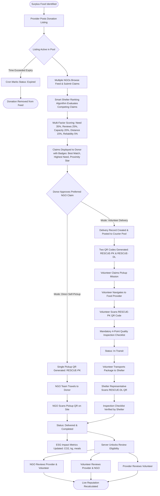
```mermaid
flowchart TD
    START([Surplus Food Identified]) --> A1[Provider Posts Donation Listing]
    A1 --> A2{Listing Active in Pool}
    
    A2 -- Time Exceeded Expiry --> A_EXP[Cron Marks Status: Expired]
    A_EXP --> END_EXP([Donation Removed from Feed])
    
    A2 --> B1[Multiple NGOs Browse Feed & Submit Claims]
    B1 --> B2[Smart Shelter Ranking Algorithm Evaluates Competing Claims]
    B2 --> B3[Multi-Factor Scoring: Need 35%, Reviews 25%, Capacity 20%, Distance 15%, Reliability 5%]
    B3 --> B4[Claims Displayed to Donor with Badges: Best Match, Highest Need, Proximity Star]
    B4 --> B5{Donor Approves Preferred NGO Claim}
    
    B5 -- Mode: Direct Self-Pickup --> SP1[Single Pickup QR Generated: RESCUE-PK]
    SP1 --> SP2[NGO Team Travels to Donor]
    SP2 --> SP3[NGO Scans Pickup QR on Site]
    SP3 --> C_COMP[Status: Delivered & Completed]
    
    B5 -- Mode: Volunteer Delivery --> V1[Delivery Record Created & Posted to Courier Pool]
    V1 --> V2[Two QR Codes Generated: RESCUE-PK & RESCUE-DL]
    V2 --> V3[Volunteer Claims Pickup Mission]
    V3 --> V4[Volunteer Navigates to Food Provider]
    
    V4 --> V5[Volunteer Scans RESCUE-PK QR Code]
    V5 --> V6[Mandatory 4-Point Quality Inspection Checklist]
    V6 --> V7[Status: In-Transit]
    
    V7 --> D1[Volunteer Transports Package to Shelter]
    D1 --> D2[Shelter Representative Scans RESCUE-DL QR]
    D2 --> D3[Inspection Checklist Verified by Shelter]
    D3 --> C_COMP
    
    C_COMP --> E1[ESG Impact Metrics Updated: CO2, kg, meals]
    C_COMP --> E2[Server Unlocks Review Eligibility]
    E2 --> E3[NGO Reviews Provider & Volunteer]
    E2 --> E4[Volunteer Reviews Provider & NGO]
    E2 --> E5[Provider Reviews Volunteer]
    E3 & E4 & E5 --> FINISH([Live Reputation Recalculated])
```

---

## 3. Authentication, Security & Lifecycle Workflows

### 3.1 Primary Authentication & Google OAuth Flow

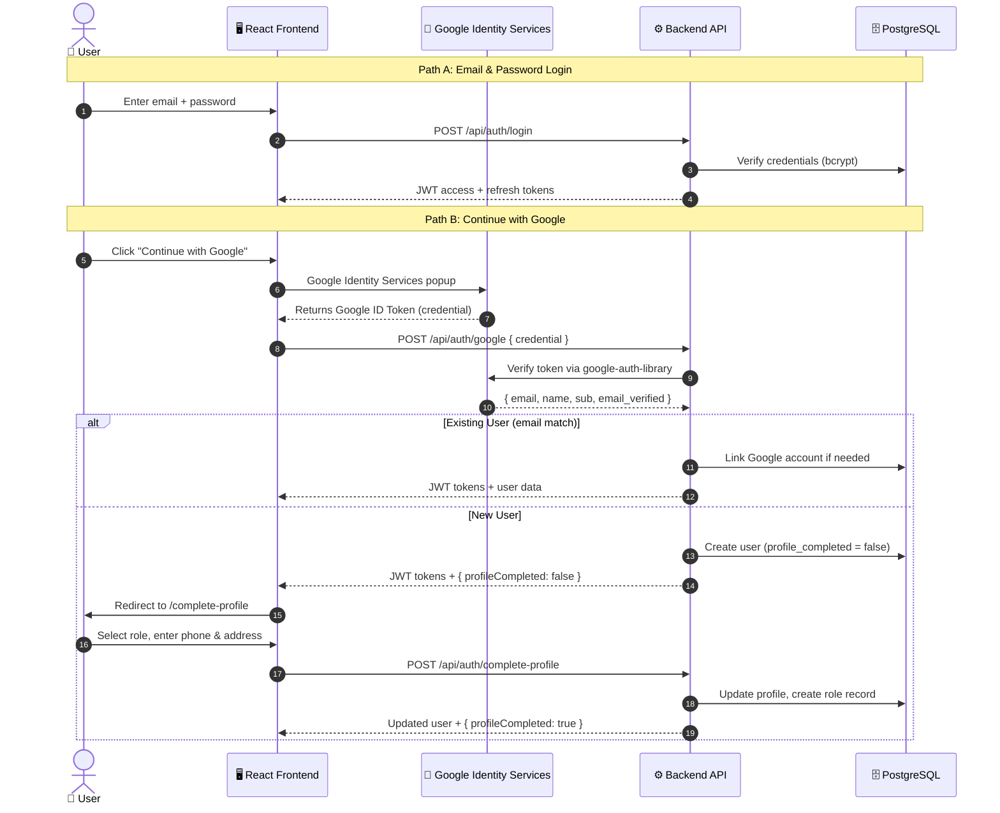
```mermaid
sequenceDiagram
    autonumber
    actor User as 👤 User
    participant Client as 🖥️ React Frontend
    participant Google as 🔐 Google Identity Services
    participant Server as ⚙️ Backend API
    participant DB as 🗄️ PostgreSQL

    Note over User,DB: Path A: Email & Password Login
    User->>Client: Enter email + password
    Client->>Server: POST /api/auth/login
    Server->>DB: Verify credentials (bcrypt)
    Server-->>Client: JWT access + refresh tokens

    Note over User,DB: Path B: Continue with Google
    User->>Client: Click "Continue with Google"
    Client->>Google: Google Identity Services popup
    Google-->>Client: Returns Google ID Token (credential)
    Client->>Server: POST /api/auth/google { credential }
    Server->>Google: Verify token via google-auth-library
    Google-->>Server: { email, name, sub, email_verified }
    
    alt Existing User (email match)
        Server->>DB: Link Google account if needed
        Server-->>Client: JWT tokens + user data
    else New User
        Server->>DB: Create user (profile_completed = false)
        Server-->>Client: JWT tokens + { profileCompleted: false }
        Client->>User: Redirect to /complete-profile
        User->>Client: Select role, enter phone & address
        Client->>Server: POST /api/auth/complete-profile
        Server->>DB: Update profile, create role record
        Server-->>Client: Updated user + { profileCompleted: true }
    end
```

### 3.2 Self-Service 6-Digit Email OTP Password Recovery

```mermaid
sequenceDiagram
    autonumber
    actor User as 👤 User
    participant Client as 🖥️ React Client
    participant Server as ⚙️ Backend API
    participant Mailer as ✉️ Nodemailer Service
    participant DB as 🗄️ PostgreSQL

    User->>Client: Enters email & requests reset
    Client->>Server: POST /api/auth/forgot-password { email }
    Server->>DB: SELECT * FROM users WHERE email = :email
    
    alt User Role === 'admin' (Super Administrator)
        Server-->>Client: 🛑 403 Forbidden: Super Admin accounts cannot use public reset
    else Regular User (Provider, NGO, Volunteer)
        Server->>Server: Generates secure 6-digit OTP (10 min TTL)
        Server->>DB: INSERT INTO password_resets (user_id, otp_hash, expires_at)
        Server->>Mailer: Dispatches password reset email
        Mailer-->>User: Delivery of 6-digit OTP code to inbox
        Server-->>Client: 200 OK: "OTP sent to registered email"
        
        User->>Client: Enters 6-digit OTP + new password
        Client->>Server: POST /api/auth/reset-password { email, otp, newPassword }
        Server->>DB: Validate OTP hash, expiry & unconsumed status
        Server->>Server: Hash new password with bcrypt
        Server->>DB: UPDATE users SET password_hash = :hash; UPDATE password_resets SET used_at = NOW()
        Server-->>Client: 200 OK: "Password successfully updated"
    end
```

### 3.3 Account Deletion & Danger Zone Governance

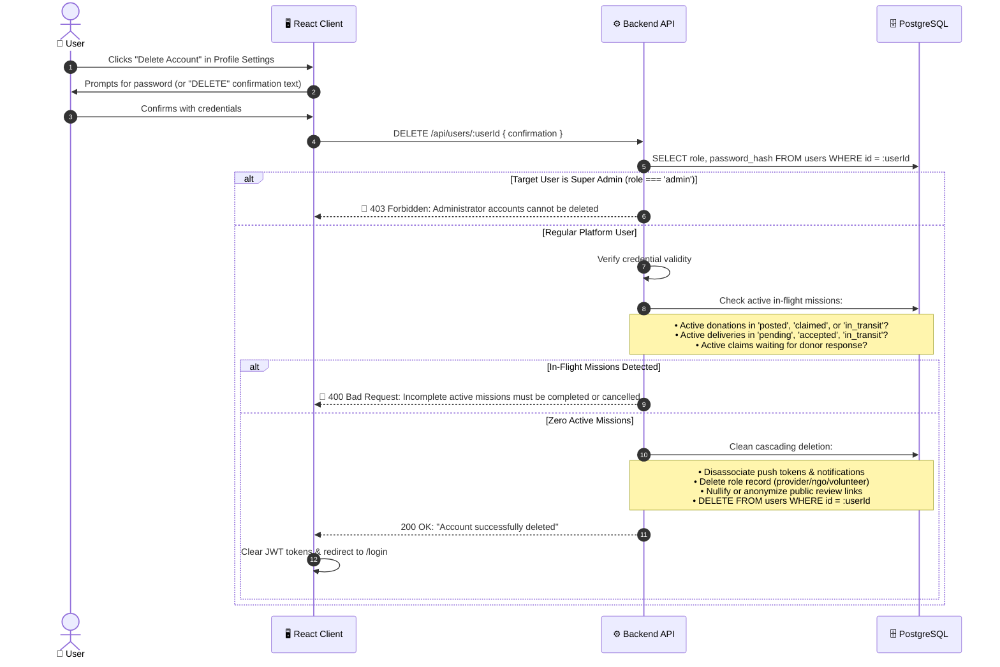
```mermaid
sequenceDiagram
    autonumber
    actor User as 👤 User
    participant Client as 🖥️ React Client
    participant Server as ⚙️ Backend API
    participant DB as 🗄️ PostgreSQL

    User->>Client: Clicks "Delete Account" in Profile Settings
    Client->>User: Prompts for password (or "DELETE" confirmation text)
    User->>Client: Confirms with credentials
    Client->>Server: DELETE /api/users/:userId { confirmation }

    Server->>DB: SELECT role, password_hash FROM users WHERE id = :userId
    
    alt Target User is Super Admin (role === 'admin')
        Server-->>Client: 🛑 403 Forbidden: Administrator accounts cannot be deleted
    else Regular Platform User
        Server->>Server: Verify credential validity
        Server->>DB: Check active in-flight missions:
        Note over Server,DB: • Active donations in 'posted', 'claimed', or 'in_transit'?<br/>• Active deliveries in 'pending', 'accepted', 'in_transit'?<br/>• Active claims waiting for donor response?
        
        alt In-Flight Missions Detected
            Server-->>Client: 🛑 400 Bad Request: Incomplete active missions must be completed or cancelled
        else Zero Active Missions
            Server->>DB: Clean cascading deletion:
            Note over Server,DB: • Disassociate push tokens & notifications<br/>• Delete role record (provider/ngo/volunteer)<br/>• Nullify or anonymize public review links<br/>• DELETE FROM users WHERE id = :userId
            Server-->>Client: 200 OK: "Account successfully deleted"
            Client->>Client: Clear JWT tokens & redirect to /login
        end
    end
```

---

## 4. Dual-QR Code Verification Pipeline

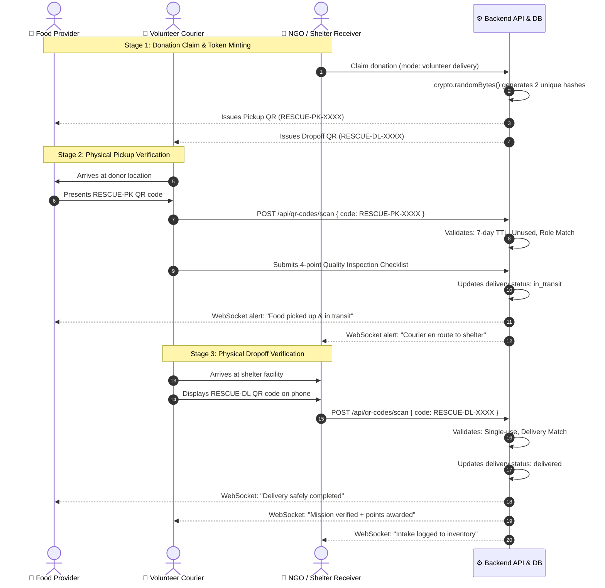
```mermaid
sequenceDiagram
    autonumber
    actor Provider as 🥖 Food Provider
    actor Volunteer as 🚚 Volunteer Courier
    actor NGO as 🤝 NGO / Shelter Receiver
    participant Server as ⚙️ Backend API & DB

    Note over Provider,NGO: Stage 1: Donation Claim & Token Minting
    NGO->>Server: Claim donation (mode: volunteer delivery)
    Server->>Server: crypto.randomBytes() generates 2 unique hashes
    Server-->>Provider: Issues Pickup QR (RESCUE-PK-XXXX)
    Server-->>Volunteer: Issues Dropoff QR (RESCUE-DL-XXXX)

    Note over Provider,Volunteer: Stage 2: Physical Pickup Verification
    Volunteer->>Provider: Arrives at donor location
    Provider->>Volunteer: Presents RESCUE-PK QR code
    Volunteer->>Server: POST /api/qr-codes/scan { code: RESCUE-PK-XXXX }
    Server->>Server: Validates: 7-day TTL, Unused, Role Match
    Volunteer->>Server: Submits 4-point Quality Inspection Checklist
    Server->>Server: Updates delivery status: in_transit
    Server-->>Provider: WebSocket alert: "Food picked up & in transit"
    Server-->>NGO: WebSocket alert: "Courier en route to shelter"

    Note over Volunteer,NGO: Stage 3: Physical Dropoff Verification
    Volunteer->>NGO: Arrives at shelter facility
    Volunteer->>NGO: Displays RESCUE-DL QR code on phone
    NGO->>Server: POST /api/qr-codes/scan { code: RESCUE-DL-XXXX }
    Server->>Server: Validates: Single-use, Delivery Match
    Server->>Server: Updates delivery status: delivered
    Server-->>Provider: WebSocket: "Delivery safely completed"
    Server-->>Volunteer: WebSocket: "Mission verified + points awarded"
    Server-->>NGO: WebSocket: "Intake logged to inventory"
```

---

## 5. Trust, Ratings & Reliability Engine Architecture

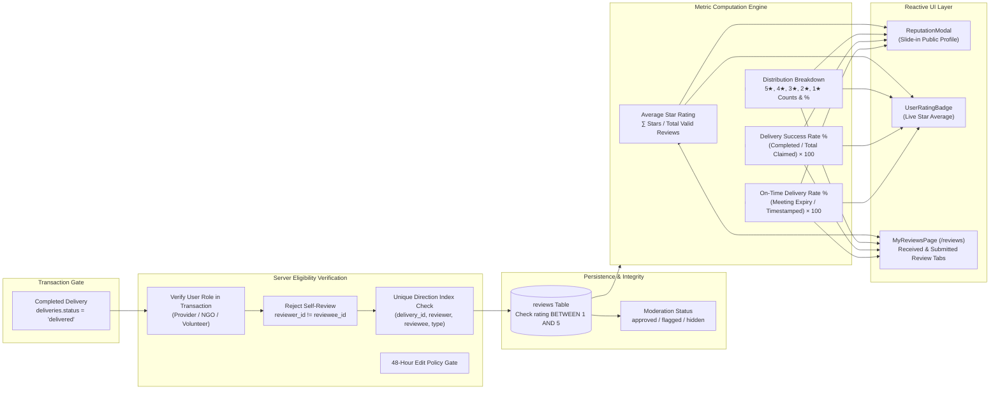
```mermaid
flowchart LR
    subgraph Trigger["Transaction Gate"]
        DELIV[Completed Delivery\ndeliveries.status = 'delivered']
    end

    subgraph Security["Server Eligibility Verification"]
        CHK_ROLE["Verify User Role in Transaction\n(Provider / NGO / Volunteer)"]
        CHK_SELF["Reject Self-Review\nreviewer_id != reviewee_id"]
        CHK_DUP["Unique Direction Index Check\n(delivery_id, reviewer, reviewee, type)"]
        CHK_TIME["48-Hour Edit Policy Gate"]
    end

    subgraph Storage["Persistence & Integrity"]
        REV_TBL[(reviews Table\nCheck rating BETWEEN 1 AND 5)]
        AUDIT[Moderation Status\napproved / flagged / hidden]
    end

    subgraph Calculations["Metric Computation Engine"]
        AVG["Average Star Rating\n∑ Stars / Total Valid Reviews"]
        DIST["Distribution Breakdown\n5★, 4★, 3★, 2★, 1★ Counts & %"]
        SUCC["Delivery Success Rate %\n(Completed / Total Claimed) × 100"]
        ONTIME["On-Time Delivery Rate %\n(Meeting Expiry / Timestamped) × 100"]
    end

    subgraph UI["Reactive UI Layer"]
        MODAL["ReputationModal\n(Slide-in Public Profile)"]
        BADGE["UserRatingBadge\n(Live Star Average)"]
        HUB["MyReviewsPage (/reviews)\nReceived & Submitted Review Tabs"]
    end

    DELIV --> CHK_ROLE --> CHK_SELF --> CHK_DUP
    CHK_DUP --> REV_TBL --> AUDIT
    REV_TBL --> Calculations
    Calculations --> AVG & DIST & SUCC & ONTIME
    AVG & DIST & SUCC & ONTIME --> MODAL & BADGE & HUB
```

---

## 6. Shelter Claim Priority & Need Ranking Algorithm Architecture

When multiple NGOs claim a single donation, the platform invokes `claim-ranking.service.js` to objectively score and sort candidate claims, balancing humanitarian need, absorption speed, community reputation, and cold-chain transport efficiency.

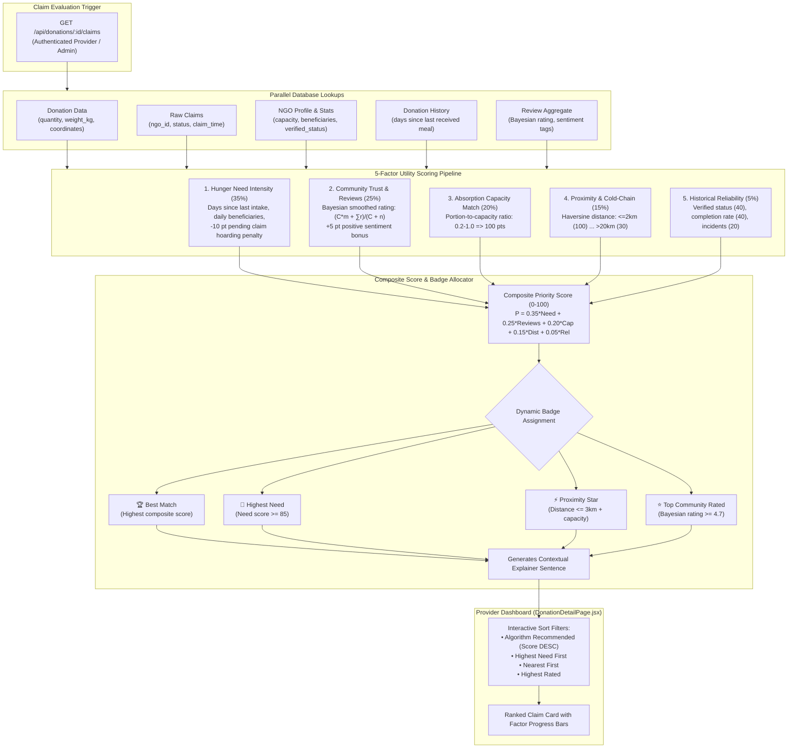
```mermaid
flowchart TD
    subgraph Trigger["Claim Evaluation Trigger"]
        REQ["GET /api/donations/:id/claims\n(Authenticated Provider / Admin)"]
    end

    subgraph DataFetch["Parallel Database Lookups"]
        D_INFO["Donation Data\n(quantity, weight_kg, coordinates)"]
        CLAIMS["Raw Claims\n(ngo_id, status, claim_time)"]
        NGO_META["NGO Profile & Stats\n(capacity, beneficiaries, verified_status)"]
        HIST["Donation History\n(days since last received meal)"]
        REVS["Review Aggregate\n(Bayesian rating, sentiment tags)"]
    end

    subgraph Normalization["5-Factor Utility Scoring Pipeline"]
        direction TB
        F1["1. Hunger Need Intensity (35%)\nDays since last intake, daily beneficiaries,\n-10 pt pending claim hoarding penalty"]
        F2["2. Community Trust & Reviews (25%)\nBayesian smoothed rating: (C*m + ∑r)/(C + n)\n+5 pt positive sentiment bonus"]
        F3["3. Absorption Capacity Match (20%)\nPortion-to-capacity ratio: 0.2-1.0 => 100 pts"]
        F4["4. Proximity & Cold-Chain (15%)\nHaversine distance: <=2km (100) ... >20km (30)"]
        F5["5. Historical Reliability (5%)\nVerified status (40), completion rate (40), incidents (20)"]
    end

    subgraph Aggregator["Composite Score & Badge Allocator"]
        SUM["Composite Priority Score (0-100)\nP = 0.35*Need + 0.25*Reviews + 0.20*Cap + 0.15*Dist + 0.05*Rel"]
        BADGE{"Dynamic Badge Assignment"}
        B_BEST["🏆 Best Match\n(Highest composite score)"]
        B_NEED["🚨 Highest Need\n(Need score >= 85)"]
        B_PROX["⚡ Proximity Star\n(Distance <= 3km + capacity)"]
        B_RATED["⭐ Top Community Rated\n(Bayesian rating >= 4.7)"]
        REASONS["Generates Contextual Explainer Sentence"]
    end

    subgraph ClientView["Provider Dashboard (DonationDetailPage.jsx)"]
        UI_SORT["Interactive Sort Filters:\n• Algorithm Recommended (Score DESC)\n• Highest Need First\n• Nearest First\n• Highest Rated"]
        UI_CARD["Ranked Claim Card with Factor Progress Bars"]
    end

    REQ --> DataFetch
    D_INFO & CLAIMS & NGO_META & HIST & REVS --> Normalization
    F1 & F2 & F3 & F4 & F5 --> SUM --> BADGE
    BADGE --> B_BEST & B_NEED & B_PROX & B_RATED
    B_BEST & B_NEED & B_PROX & B_RATED --> REASONS --> UI_SORT --> UI_CARD
```

### Mathematical Formula

$$\text{Priority Score} = \text{round}\left(S_{\text{need}} \times 0.35 + S_{\text{reviews}} \times 0.25 + S_{\text{capacity}} \times 0.20 + S_{\text{distance}} \times 0.15 + S_{\text{reliability}} \times 0.05\right)$$

Where Bayesian rating smoothing dampens small-sample variance:
$$R_{\text{Bayes}} = \frac{C \cdot m + \sum_{i=1}^{n} r_i}{C + n} \quad (C=3, \; m=4.2)$$

---

## 7. Complaint & Incident Resolution Architecture

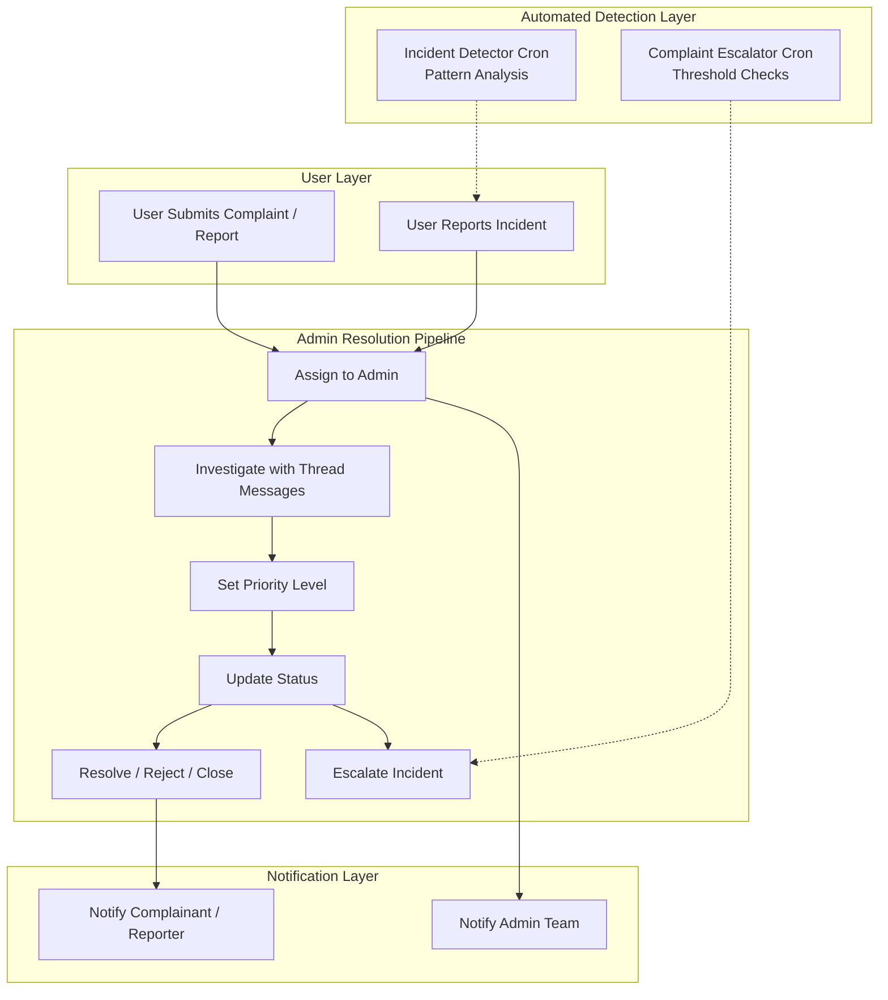
```mermaid
flowchart TD
    subgraph UserActions["User Layer"]
        SUBMIT[User Submits Complaint / Report]
        REPORT[User Reports Incident]
    end

    subgraph AutoDetection["Automated Detection Layer"]
        CRON_INC[Incident Detector Cron\nPattern Analysis]
        CRON_ESC[Complaint Escalator Cron\nThreshold Checks]
    end

    subgraph AdminWorkflow["Admin Resolution Pipeline"]
        direction TB
        ASSIGN[Assign to Admin]
        INVESTIGATE[Investigate with Thread Messages]
        PRIORITY[Set Priority Level]
        STATUS[Update Status]
        RESOLVE[Resolve / Reject / Close]
        ESCALATE[Escalate Incident]
    end

    subgraph Notifications["Notification Layer"]
        NOTIFY_USER[Notify Complainant / Reporter]
        NOTIFY_ADMIN[Notify Admin Team]
    end

    SUBMIT --> ASSIGN
    REPORT --> ASSIGN
    CRON_INC -.-> REPORT
    CRON_ESC -.-> ESCALATE
    ASSIGN --> INVESTIGATE --> PRIORITY --> STATUS --> RESOLVE
    STATUS --> ESCALATE
    RESOLVE --> NOTIFY_USER
    ASSIGN --> NOTIFY_ADMIN
```

---

## 8. Relational Database Architecture (Entity Relationship Diagram)

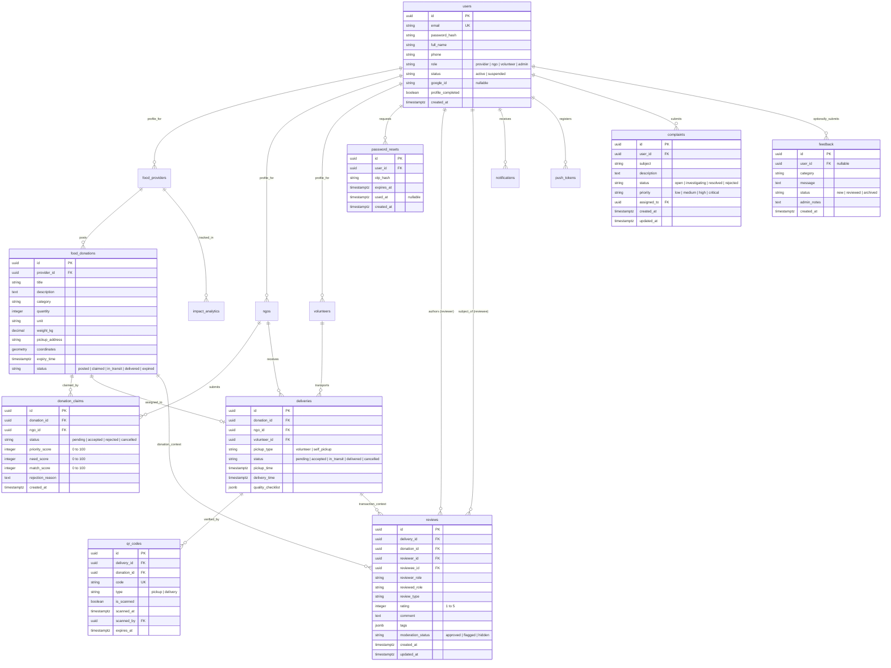
```mermaid
erDiagram
    users ||--o{ food_providers : "profile_for"
    users ||--o{ ngos : "profile_for"
    users ||--o{ volunteers : "profile_for"
    users ||--o{ password_resets : "requests"
    
    food_providers ||--o{ food_donations : "posts"
    food_donations ||--o{ donation_claims : "claimed_by"
    ngos ||--o{ donation_claims : "submits"
    
    food_donations ||--o| deliveries : "assigned_to"
    ngos ||--o{ deliveries : "receives"
    volunteers ||--o{ deliveries : "transports"
    
    deliveries ||--o{ qr_codes : "verified_by"
    
    users ||--o{ reviews : "authors (reviewer)"
    users ||--o{ reviews : "subject_of (reviewee)"
    deliveries ||--o{ reviews : "transaction_context"
    food_donations ||--o{ reviews : "donation_context"
    
    users ||--o{ notifications : "receives"
    users ||--o{ push_tokens : "registers"
    users ||--o{ complaints : "submits"
    users ||--o{ feedback : "optionally_submits"
    food_providers ||--o{ impact_analytics : "tracked_in"

    users {
        uuid id PK
        string email UK
        string password_hash
        string full_name
        string phone
        string role "provider | ngo | volunteer | admin"
        string status "active | suspended"
        string google_id "nullable"
        boolean profile_completed
        timestamptz created_at
    }

    password_resets {
        uuid id PK
        uuid user_id FK
        string otp_hash
        timestamptz expires_at
        timestamptz used_at "nullable"
        timestamptz created_at
    }

    food_donations {
        uuid id PK
        uuid provider_id FK
        string title
        text description
        string category
        integer quantity
        string unit
        decimal weight_kg
        string pickup_address
        geometry coordinates
        timestamptz expiry_time
        string status "posted | claimed | in_transit | delivered | expired"
    }

    donation_claims {
        uuid id PK
        uuid donation_id FK
        uuid ngo_id FK
        string status "pending | accepted | rejected | cancelled"
        integer priority_score "0 to 100"
        integer need_score "0 to 100"
        integer match_score "0 to 100"
        text rejection_reason
        timestamptz created_at
    }

    deliveries {
        uuid id PK
        uuid donation_id FK
        uuid ngo_id FK
        uuid volunteer_id FK
        string pickup_type "volunteer | self_pickup"
        string status "pending | accepted | in_transit | delivered | cancelled"
        timestamptz pickup_time
        timestamptz delivery_time
        jsonb quality_checklist
    }

    qr_codes {
        uuid id PK
        uuid delivery_id FK
        uuid donation_id FK
        string code UK
        string type "pickup | delivery"
        boolean is_scanned
        timestamptz scanned_at
        uuid scanned_by FK
        timestamptz expires_at
    }

    reviews {
        uuid id PK
        uuid delivery_id FK
        uuid donation_id FK
        uuid reviewer_id FK
        uuid reviewee_id FK
        string reviewer_role
        string reviewed_role
        string review_type
        integer rating "1 to 5"
        text comment
        jsonb tags
        string moderation_status "approved | flagged | hidden"
        timestamptz created_at
        timestamptz updated_at
    }

    complaints {
        uuid id PK
        uuid user_id FK
        string subject
        text description
        string status "open | investigating | resolved | rejected"
        string priority "low | medium | high | critical"
        uuid assigned_to FK
        timestamptz created_at
        timestamptz updated_at
    }

    feedback {
        uuid id PK
        uuid user_id FK "nullable"
        string category
        text message
        string status "new | reviewed | archived"
        text admin_notes
        timestamptz created_at
    }
```

> [!NOTE]
> **Cascading Deletion Lifecycle**: When a non-admin account is deleted via `DELETE /api/users/:id`, all child profile rows (`food_providers`, `ngos`, `volunteers`), device push tokens (`push_tokens`), unconsumed OTP tokens (`password_resets`), and unread notifications are cascaded safely. Reviews are preserved with anonymized user linkage to prevent transaction record distortion.

---

## 9. Automated Expiry & Background Scheduling Flow

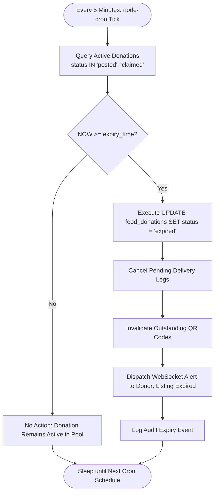
```mermaid
flowchart TD
    TICK([Every 5 Minutes: node-cron Tick]) --> Q1[Query Active Donations\nstatus IN 'posted', 'claimed']
    Q1 --> Q2{NOW >= expiry_time?}
    
    Q2 -- Yes --> EXP1[Execute UPDATE food_donations SET status = 'expired']
    EXP1 --> EXP2[Cancel Pending Delivery Legs]
    EXP2 --> EXP3[Invalidate Outstanding QR Codes]
    EXP3 --> EXP4[Dispatch WebSocket Alert to Donor: Listing Expired]
    EXP4 --> EXP5[Log Audit Expiry Event]
    
    Q2 -- No --> LOG[No Action: Donation Remains Active in Pool]
    LOG --> SLEEP([Sleep until Next Cron Schedule])
    EXP5 --> SLEEP
```

---

## 10. Frontend Component Hierarchy & Global State Topology

```mermaid
graph TD
    subgraph Providers["Global Context Infrastructure"]
        AP[App.jsx] --> AUTH_CTX[AuthContext\nSession, JWT, Active Role]
        AP --> REP_CTX[ReputationContext\nopenReputation modal handler]
        AP --> THEME_CTX[ThemeContext\nDark / Light Mode State]
    end

    subgraph Pages["Primary Page Routes"]
        LAND[LandingPage\n/]
        LOGIN[LoginPage\n/login]
        REGISTER[RegisterPage\n/register]
        COMPLETE[CompleteProfilePage\n/complete-profile]
        CONTACT_PAGE[ContactPage\n/contact]
        BROWSE[BrowseDonationsPage\n/browse]
        DETAIL[DonationDetailPage\n/donations/:id\nClaim Priority Badges & Explainer]
        DELIV_PAGE[DeliveriesPage\n/deliveries]
        CLAIMS_PAGE[ClaimsPage\n/claims]
        REVIEWS_PAGE[MyReviewsPage\n/reviews]
        PROFILE[ProfilePage\n/profile\nSecurity & Danger Zone Deletion]
        FEEDBACK[FeedbackPage\n/feedback]
        COMPLAINTS[MyComplaintsPage\n/complaints]
        NOTIF[NotificationsPage\n/notifications]
    end

    subgraph AdminPages["Admin Page Routes"]
        ADM_ANALYTICS[AdminAnalyticsPage\n/admin/analytics]
        ADM_INCIDENTS[IncidentsPage\n/admin/incidents]
        ADM_COMPLAINTS[ComplaintsPage\n/admin/complaints]
        ADM_FEEDBACK[AdminFeedbackPage\n/admin/feedback]
        ADM_VERIFY[VerificationsPage\n/admin/verifications]
        ADM_USERS[UsersPage\n/admin/users]
        ADM_AUDIT[AuditLogsPage\n/admin/audit-logs]
    end

    subgraph AuthModals["Security & Auth Modals"]
        FORGOT_MODAL[ForgotPasswordModal\n6-Digit OTP Request]
        RESET_MODAL[ResetPasswordModal\nOTP Verification & Reset]
        EMAIL_MODAL[EmailVerificationModal\nClean OTP Verification]
    end

    subgraph ReusableReviews["Trust & Reliability Component Suite"]
        LINK[UserReputationLink\nClickable name + verified badge]
        MODAL[ReputationModal\nDrawer with stats & review list]
        BADGE[UserRatingBadge\nCompact star score]
        LIST[ReviewList\nSorted, paginated review feed]
        CARD[ReviewCard\nReviewer, stars, tags, date]
        SUBMIT[SubmitReviewModal\n1-5 stars + sentiment tag selection]
        INDICATOR[ReviewEligibilityIndicator\nInline transaction action trigger]
    end

    subgraph CommonComponents["Shared Components"]
        GOOGLE_BTN[GoogleAuthButton\nOAuth 2.0 Sign-in]
        MAP_PICKER[MapAddressPickerModal\nAddress + location picker]
        QR_SCAN[QRScanPage\nQR code scanner]
        NOTIF_POPUP[NotificationPopup\nReal-time WebSocket alerts]
        THEME_TOG[ThemeToggle\nDark / Light switch]
    end

    REP_CTX --> MODAL
    BROWSE --> LINK
    DETAIL --> LINK & INDICATOR
    DELIV_PAGE --> LINK & INDICATOR
    CLAIMS_PAGE --> LINK & INDICATOR
    PROFILE --> BADGE & LINK & RESET_MODAL
    REVIEWS_PAGE --> LIST & SUBMIT
    LIST --> CARD
    LINK -.->|Clicks Trigger| REP_CTX
    INDICATOR -.->|Eligible Click| SUBMIT
    LOGIN --> GOOGLE_BTN & FORGOT_MODAL
    REGISTER --> GOOGLE_BTN & MAP_PICKER & EMAIL_MODAL
    FORGOT_MODAL --> RESET_MODAL
```

---

## 11. Data Isolation & Role-Based Access Control

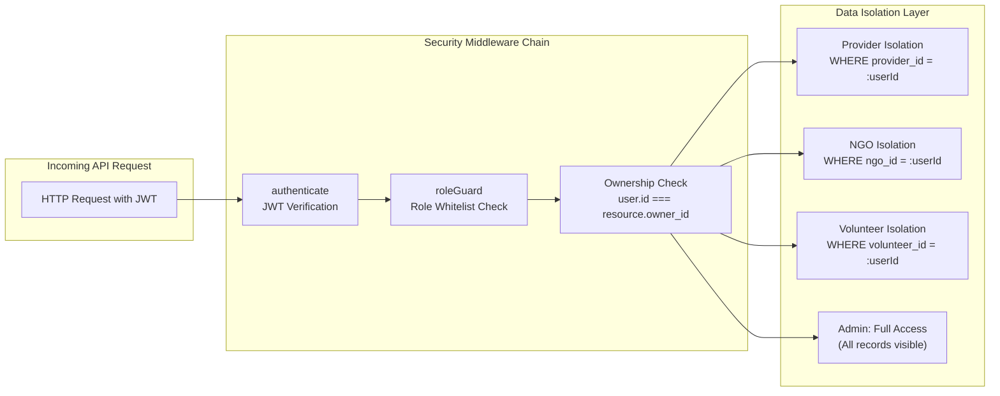
```mermaid
flowchart LR
    subgraph Request["Incoming API Request"]
        REQ[HTTP Request with JWT]
    end

    subgraph Guards["Security Middleware Chain"]
        AUTH[authenticate\nJWT Verification]
        ROLE[roleGuard\nRole Whitelist Check]
        OWN[Ownership Check\nuser.id === resource.owner_id]
    end

    subgraph Isolation["Data Isolation Layer"]
        PROV_ISO["Provider Isolation\nWHERE provider_id = :userId"]
        NGO_ISO["NGO Isolation\nWHERE ngo_id = :userId"]
        VOL_ISO["Volunteer Isolation\nWHERE volunteer_id = :userId"]
        ADMIN_ALL["Admin: Full Access\n(All records visible)"]
    end

    REQ --> AUTH --> ROLE --> OWN
    OWN --> PROV_ISO & NGO_ISO & VOL_ISO & ADMIN_ALL
```

---

## 12. Notification Isolation Architecture

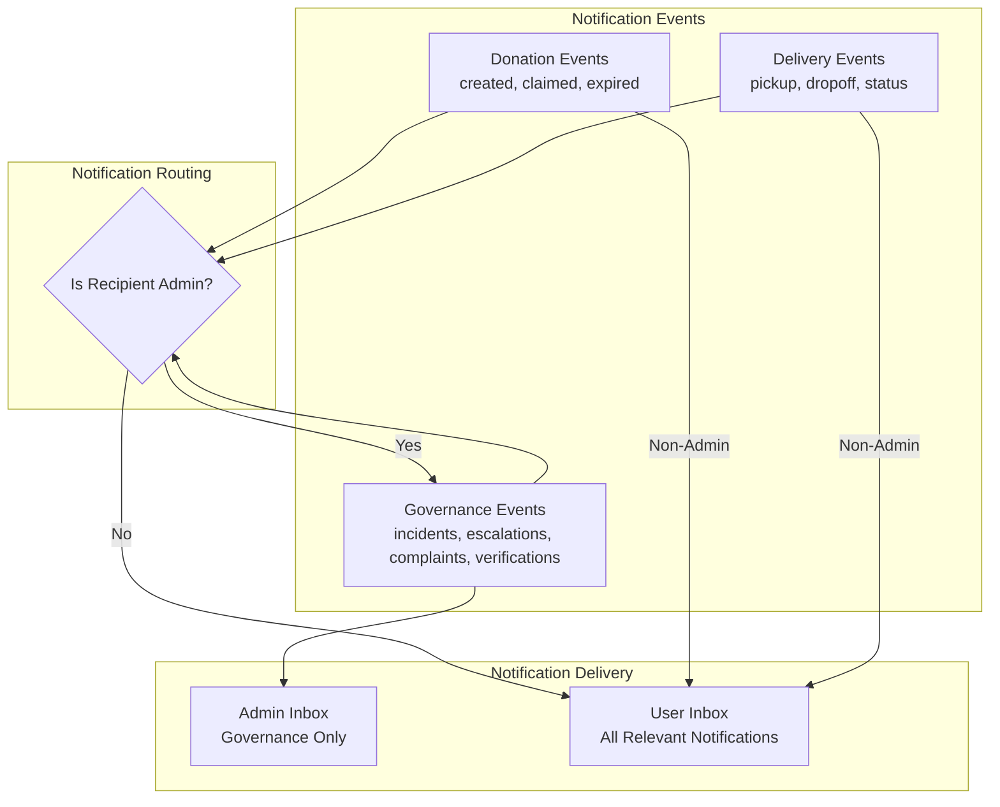
```mermaid
flowchart TD
    subgraph Events["Notification Events"]
        DON_EVENT[Donation Events\ncreated, claimed, expired]
        DELIV_EVENT[Delivery Events\npickup, dropoff, status]
        GOV_EVENT[Governance Events\nincidents, escalations, complaints, verifications]
    end

    subgraph Filter["Notification Routing"]
        ADMIN_FILTER{Is Recipient Admin?}
    end

    subgraph Delivery["Notification Delivery"]
        ADMIN_INBOX[Admin Inbox\nGovernance Only]
        USER_INBOX[User Inbox\nAll Relevant Notifications]
    end

    DON_EVENT --> ADMIN_FILTER
    DELIV_EVENT --> ADMIN_FILTER
    GOV_EVENT --> ADMIN_FILTER

    ADMIN_FILTER -- Yes --> GOV_EVENT --> ADMIN_INBOX
    ADMIN_FILTER -- No --> USER_INBOX
    DON_EVENT -- Non-Admin --> USER_INBOX
    DELIV_EVENT -- Non-Admin --> USER_INBOX
```

---

## 13. Continuous Integration & Verification Pipeline

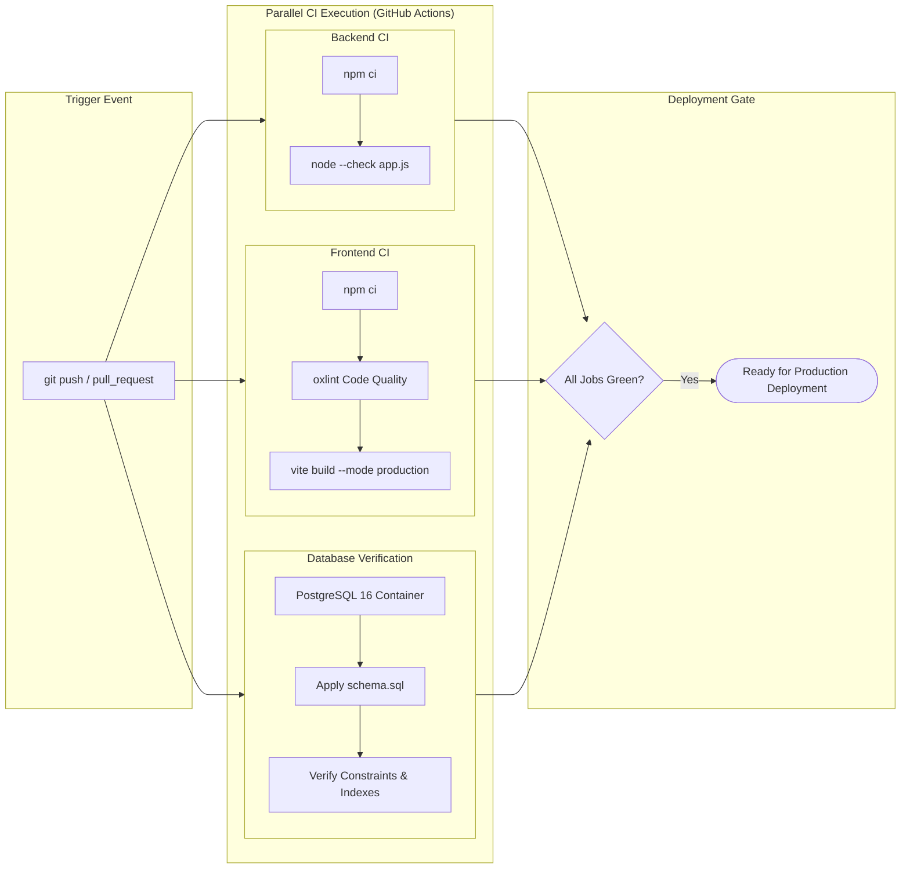
```mermaid
flowchart LR
    subgraph GitEvents["Trigger Event"]
        PUSH[git push / pull_request]
    end

    subgraph Jobs["Parallel CI Execution (GitHub Actions)"]
        direction TB
        subgraph BackendJob["Backend CI"]
            B1[npm ci] --> B2[node --check app.js]
        end

        subgraph FrontendJob["Frontend CI"]
            F1[npm ci] --> F2[oxlint Code Quality]
            F2 --> F3[vite build --mode production]
        end

        subgraph SchemaJob["Database Verification"]
            D1[PostgreSQL 16 Container] --> D2[Apply schema.sql]
            D2 --> D4[Verify Constraints & Indexes]
        end
    end

    subgraph DeployGate["Deployment Gate"]
        GATE{All Jobs Green?}
        READY([Ready for Production Deployment])
    end

    PUSH --> BackendJob & FrontendJob & SchemaJob
    BackendJob & FrontendJob & SchemaJob --> GATE
    GATE -- Yes --> READY
```

---

## 14. Mobile Native Bridge & 4:3 QR Scanner Architecture

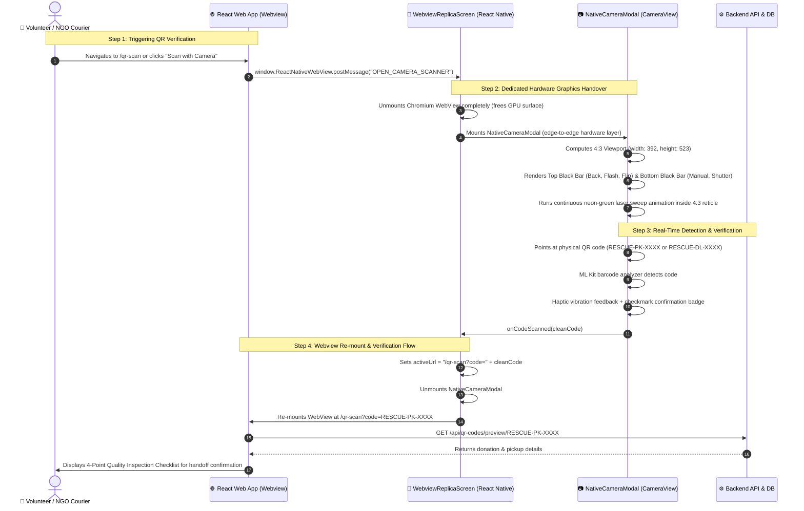
```mermaid
sequenceDiagram
    autonumber
    actor User as 👤 Volunteer / NGO Courier
    participant Web as 🌐 React Web App (Webview)
    participant Replica as 📱 WebviewReplicaScreen (React Native)
    participant Camera as 📷 NativeCameraModal (CameraView)
    participant Server as ⚙️ Backend API & DB

    Note over User,Web: Step 1: Triggering QR Verification
    User->>Web: Navigates to /qr-scan or clicks "Scan with Camera"
    Web->>Replica: window.ReactNativeWebView.postMessage("OPEN_CAMERA_SCANNER")
    
    Note over Replica,Camera: Step 2: Dedicated Hardware Graphics Handover
    Replica->>Replica: Unmounts Chromium WebView completely (frees GPU surface)
    Replica->>Camera: Mounts NativeCameraModal (edge-to-edge hardware layer)
    Camera->>Camera: Computes 4:3 Viewport (width: 392, height: 523)
    Camera->>Camera: Renders Top Black Bar (Back, Flash, Flip) & Bottom Black Bar (Manual, Shutter)
    Camera->>Camera: Runs continuous neon-green laser sweep animation inside 4:3 reticle

    Note over Camera,Server: Step 3: Real-Time Detection & Verification
    Camera->>Camera: Points at physical QR code (RESCUE-PK-XXXX or RESCUE-DL-XXXX)
    Camera->>Camera: ML Kit barcode analyzer detects code
    Camera->>Camera: Haptic vibration feedback + checkmark confirmation badge
    Camera->>Replica: onCodeScanned(cleanCode)
    
    Note over Replica,Web: Step 4: Webview Re-mount & Verification Flow
    Replica->>Replica: Sets activeUrl = "/qr-scan?code=" + cleanCode
    Replica->>Replica: Unmounts NativeCameraModal
    Replica->>Web: Re-mounts WebView at /qr-scan?code=RESCUE-PK-XXXX
    Web->>Server: GET /api/qr-codes/preview/RESCUE-PK-XXXX
    Server-->>Web: Returns donation & pickup details
    Web->>User: Displays 4-Point Quality Inspection Checklist for handoff confirmation
```

---

## 15. Interactive Location Picker & Geolocation Bridge Topology

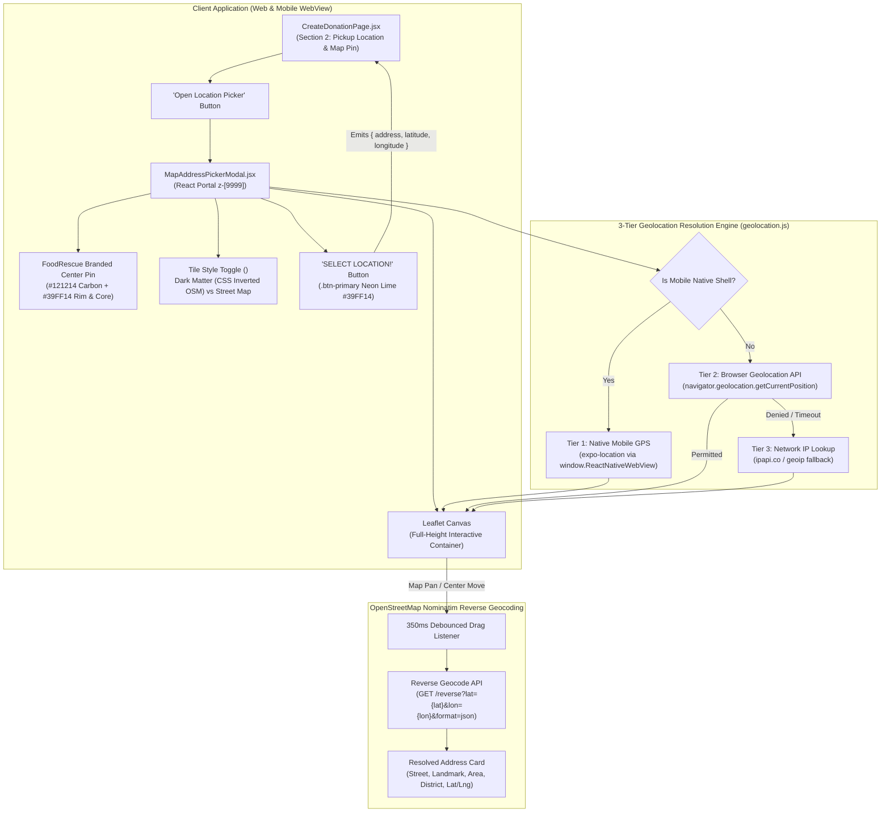
```mermaid
flowchart TD
    subgraph Client["Client Application (Web & Mobile WebView)"]
        FORM["CreateDonationPage.jsx\n(Section 2: Pickup Location & Map Pin)"]
        BTN["'Open Location Picker' Button"]
        MODAL["MapAddressPickerModal.jsx\n(React Portal z-[9999])"]
        CANVAS["Leaflet Canvas\n(Full-Height Interactive Container)"]
        PIN["FoodRescue Branded Center Pin\n(#121214 Carbon + #39FF14 Rim & Core)"]
        STYLE["Tile Style Toggle (<Layers />)\nDark Matter (CSS Inverted OSM) vs Street Map"]
        CONFIRM["'SELECT LOCATION!' Button\n(.btn-primary Neon Lime #39FF14)"]
    end

    subgraph GeoEngine["3-Tier Geolocation Resolution Engine (geolocation.js)"]
        CHECK{"Is Mobile Native Shell?"}
        NAT_GPS["Tier 1: Native Mobile GPS\n(expo-location via window.ReactNativeWebView)"]
        BROW_GPS["Tier 2: Browser Geolocation API\n(navigator.geolocation.getCurrentPosition)"]
        IP_GEO["Tier 3: Network IP Lookup\n(ipapi.co / geoip fallback)"]
    end

    subgraph Nominatim["OpenStreetMap Nominatim Reverse Geocoding"]
        REV_API["Reverse Geocode API\n(GET /reverse?lat={lat}&lon={lon}&format=json)"]
        DEBOUNCE["350ms Debounced Drag Listener"]
        ADDR_CARD["Resolved Address Card\n(Street, Landmark, Area, District, Lat/Lng)"]
    end

    FORM --> BTN --> MODAL
    MODAL --> CANVAS & PIN & STYLE
    MODAL --> CHECK
    CHECK -- Yes --> NAT_GPS --> CANVAS
    CHECK -- No --> BROW_GPS
    BROW_GPS -- Permitted --> CANVAS
    BROW_GPS -- Denied / Timeout --> IP_GEO --> CANVAS

    CANVAS -- Map Pan / Center Move --> DEBOUNCE --> REV_API
    REV_API --> ADDR_CARD
    MODAL --> CONFIRM
    CONFIRM -- Emits { address, latitude, longitude } --> FORM
```

---

## 16. Real-Time & Push Notification Distribution Architecture

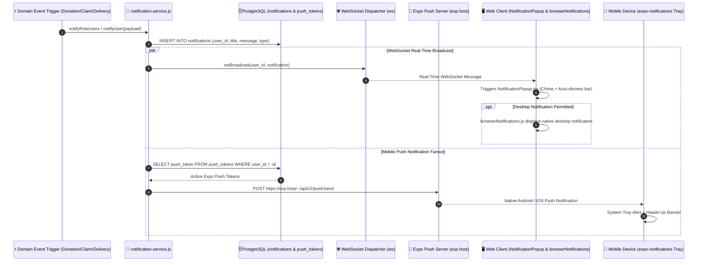
```mermaid
sequenceDiagram
    autonumber
    participant Event as ⚡ Domain Event Trigger (Donation/Claim/Delivery)
    participant Svc as 🔔 notification.service.js
    participant DB as 🗄️ PostgreSQL (notifications & push_tokens)
    participant WS as 🌐 WebSocket Dispatcher (ws)
    participant Expo as 📱 Expo Push Server (exp.host)
    participant WebClient as 🖥️ Web Client (NotificationPopup & browserNotifications)
    participant MobileApp as 📲 Mobile Device (expo-notifications Tray)

    Event->>Svc: notifyRoleUsers / notifyUser(payload)
    Svc->>DB: INSERT INTO notifications (user_id, title, message, type)
    
    par WebSocket Real-Time Broadcast
        Svc->>WS: wsBroadcast(user_id, notification)
        WS-->>WebClient: Real-Time WebSocket Message
        WebClient->>WebClient: Triggers NotificationPopup.jsx (Chime + Auto-dismiss bar)
        opt Desktop Notification Permitted
            WebClient->>WebClient: browserNotifications.js displays native desktop notification
        end
    and Mobile Push Notification Fanout
        Svc->>DB: SELECT push_token FROM push_tokens WHERE user_id = :id
        DB-->>Svc: Active Expo Push Tokens
        Svc->>Expo: POST https://exp.host/--/api/v2/push/send
        Expo-->>MobileApp: Native Android / iOS Push Notification
        MobileApp->>MobileApp: System Tray Alert + Heads-Up Banner
    end
```

